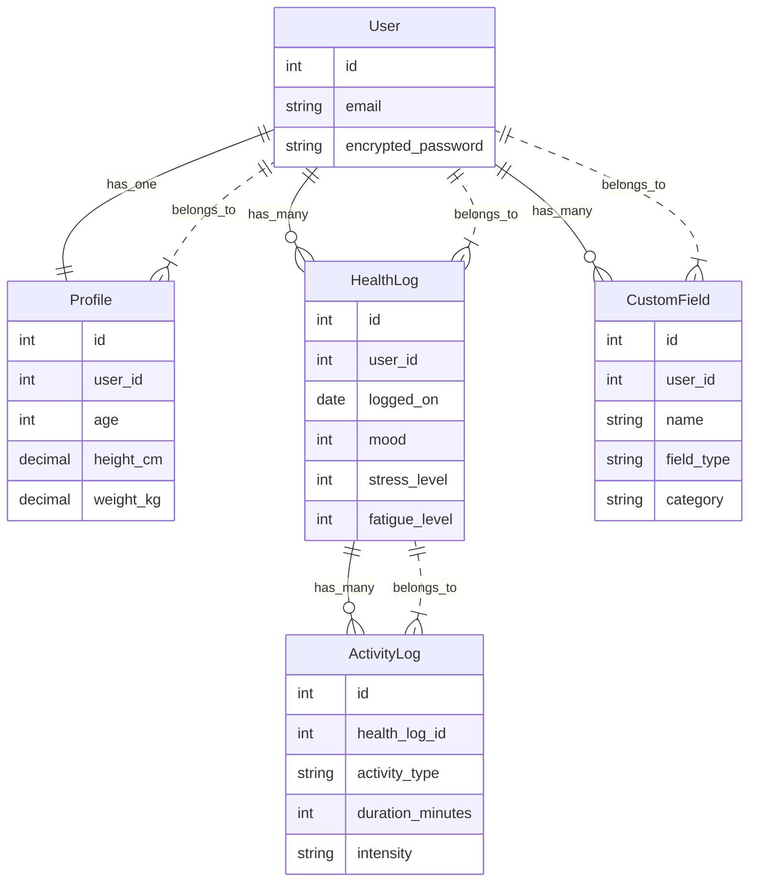

# スタイルガイド

このドキュメントでは、BootstrapとMaterial Designを組み合わせたUIのスタイルガイドについて説明します。

## カラー

- Primary color: #3F51B5 (Indigo系)
- Secondary color: #03DAC6 (Teal系)
- Background color: #FFFFFF
- Surface color: #FFFFFF
- Error color: #B00020

## Elevation (影)

- Material DesignのElevationを意識し、コンポーネントに影を付けます。

## 角丸

- シャープさのある角丸を使用します。Bootstrapの`.rounded-*`を併用し、MD風の形状にします。

## コンポーネント

### ナビゲーションバー（Navbar）

- Bootstrapの`navbar`コンポーネントを利用します。
- 色はprimaryカラーを使用します。
- 高さはデフォルトのまま、または少し広めに取ります。
- 影（`box-shadow`）を付与します。
- ロゴやタイトルを左、メニューボタン（ハンバーガー）を右に配置します（モバイル最適化）。

### カードレイアウト（Card）

- Bootstrapの`card`コンポーネントを利用します。
- Material DesignのElevationを意識し、`.shadow-sm`や`.shadow-lg`を適宜利用します。
- 角丸はデフォルトか、`.rounded-3`などでMaterial Designに近づけます。

### ボタン（Button）

- Bootstrapの`btn`コンポーネントを利用します。
- Primaryボタン：Material Designの「コンテインドボタン」風に、`btn-primary`をベースに`btn-lg`などで視認性を向上させます。
- Secondaryボタン：Material Designの「アウトラインボタン」を参考に、`btn-outline-secondary`を使用します。
- クリック時にリップル効果を出す場合は、追加のJSで演出します。

### フォーム（Form）

- Bootstrapの`form`とForm controlsを利用します。
- ラベル上部配置（Material Designに多いスタイル）にします。
- エラーメッセージやバリデーション時は、赤字テキスト + アイコン表示でユーザにわかりやすくします。
- フォーカス時にMaterial Designっぽい濃いめのボーダー色か影を付与します。

### モーダル（Modal）

- Bootstrapの`modal`コンポーネントを活用します。
- Material Designのダイアログに倣い、角丸 + 適度な影を追加します。
- テキストは中央寄せまたは左揃えにし、適切な余白（24px前後）を確保します。

## レイアウト & グリッド

- Bootstrapのgrid system（`.row`, `.col-*`）を使用し、レスポンシブ対応します。
- 余白（margin/padding）はMaterial Designガイドライン（8dp刻みなど）を意識し、`.mb-3`や`.p-3`などを適宜付与します。

## レスポンシブ/ブレークポイント

- Bootstrapの標準ブレークポイント(xs,sm,md,lg,xl)を利用します。
- 主要画面のレイアウトをモバイルファーストで設計し、`.col-md-*`などで段組みを切り替えます。

## アイコン

- Material IconsやFont Awesomeなど、好みに応じて使用します。
- Material Design準拠ならMaterial Symbolsが最適です。

## JavaScript

- このプロジェクトでは、Turbolinks ではなく Turbo を使用しています。
- JavaScript は jsbundling-rails と importmap を使用して管理しています。

## モデルの関係性

以下に最新のデータモデルの関係性を示します。

* User
    * has_one Profile
    * has_many HealthLogs
    * has_many ActivityLogs (through HealthLogs)
    * has_many CustomFields
* Profile
    * belongs_to User
* HealthLog
    * belongs_to User
    * has_many ActivityLogs
* ActivityLog
    * belongs_to HealthLog
* CustomField
    * belongs_to User

